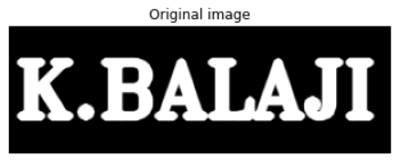
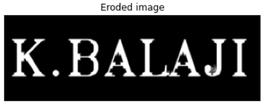
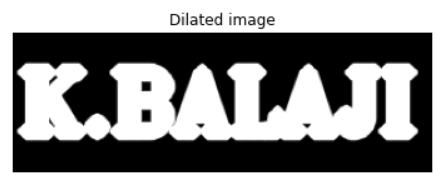

# Implementation-of-Erosion-and-Dilation
## Aim
To implement Erosion and Dilation using Python and OpenCV.
## Software Required
1. Anaconda - Python 3.7
2. OpenCV
## Algorithm:
### Step1:
Import the necessary packages cv2, numpy and matplotlib.

### Step2:
Create the text using the built in function cv2.putText()

### Step3:
Create the structuring element.

### Step4:
Erode and Dilate the image using cv2.erode() and cv2.dilate()

### Step5:
Run the program and execute the outputs.

 
## Program:
```
Program developed by : K.Balaji
Register number : 212221230011
```

``` Python
# Import the necessary packages
import cv2
import numpy as np
import matplotlib.pyplot as plt


# Create the Text using cv2.putText
image=np.zeros((100,300), dtype = 'uint8')
font=cv2.FONT_HERSHEY_TRIPLEX
cv2.putText(image,'K.BALAJI',(5,70), font, 2,(255),5,cv2.LINE_AA)
plt.imshow(image,cmap='gray')
plt.axis('off')
plt.title('Original image')


# Create the structuring element
kernel = cv2.getStructuringElement(cv2.MORPH_CROSS,(7,7))


# Erode the image
erode_image=cv2.erode(image,kernel)
plt.imshow(erode_image,cmap='gray')
plt.axis('off')
plt.title('Eroded image')


# Dilate the image
dilate_image=cv2.dilate(image,kernel)
plt.imshow(dilate_image,cmap='gray')
plt.axis('off')
plt.title('Dilated image')

```
## Output:

### Display the input Image


<br>
<br>
<br>


### Display the Eroded Image

<br>
<br>
<br>

### Display the Dilated Image

<br>
<br>


## Result
Thus the generated text image is eroded and dilated using python and OpenCV.